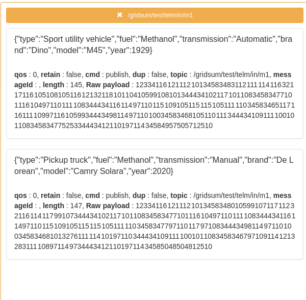
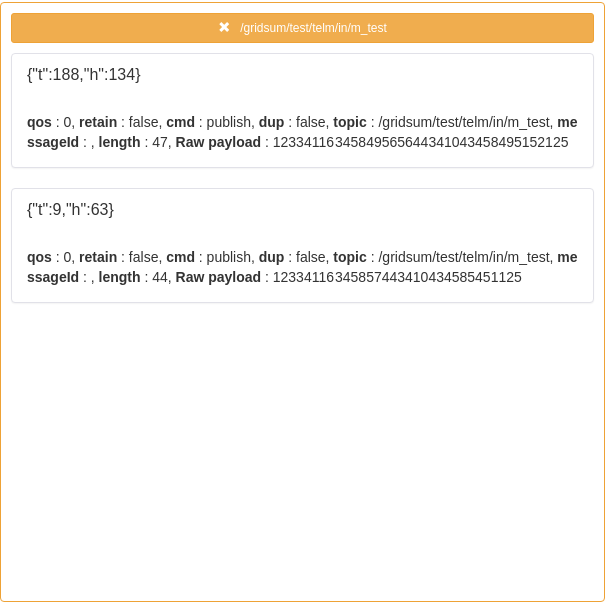

# pyboot

English | [Chinese](README_zh.md)

The original purpose of this project was to call scientific computing models on the edge for edge computing scenarios.

## Architecture


## Features
### 1. starter
The system components can be expanded through the implementation of Starter. 
At present, the system provides several components for configuration, multi-process processing, and webserver. 
Finally, the system interrupts and stop signals are uniformly accepted to call the Stop function of `HookStarter` 
to recover all resources and stop the service.

1. `BaseConfStarter`:
   Provide the relevant parameters of a unified custom configuration for the entire system. 
   The relevant configuration information can be expanded by modifying the `config.yaml` and `config.py` files, 
   and the system built-in parameters are provided by the `settings.py` file;
2. `ProcessorStarter`:
   Provides multi-process and multi-threaded call functions for edge model calls. 
   The default overall call logic of an edge model will be extended to an independent sub-process, 
   and for a model call, its data transmission and reception and model call, 
   then Use more in the multithreading of this child process;
3. `TornadoServer` or `FlaskStarter`:
   Provides a unified web service for the main process, 
   currently provides two optional frameworks based on `Flask` and `Tornado`;
4. `HookStarter`:
   The `Stop` functions of all integrated components are registered and managed uniformly, 
   and the resources can be recycled in order by priority, and finally the operation of the entire service is stopped;
### 2. boot
The boot program that the system starts, loads each Starter configured in brun/__init__.py, 
and executes the Init, Setup, and Start functions of all Starter components in turn when boot.Starter() is called. 
The penultimate Starter should be It is a component with blocking function (such as FlaskStarter, TornadoStarter), 
the last one should be HookStarter;

## Configuration
```yaml
---
app_name: pyboot
description: pyboot for edge calc
edge:
  - name: telm_temperature # subscirbe_name: sub_process_{name}_{instance}
    instance: 1
    # input data from mqtt broker
    pre_broker: 192.168.241.1
    pre_port: 1883
    pre_topic: /gridsum/test/telm/in/m1
    pre_qos: 0
    # edge model config path: {package_full_name}.{py_module_file_name}.{func_name}
    edge_mode: pyboot.modules.gridsum.science.industry.telemetry.telm_temperature
    # input data from mqtt broker
    post_broker: 192.168.241.1
    post_port: 1883
    post_topic: /gridsum/test/telm/out/m1
    post_qos: 0


```
## Start run
```shell
pip install -r /home/requirements.txt -i https://pypi.tuna.tsinghua.edu.cn/simple

export PYTHONPATH=$PYTHONPATH:`pwd`:'pwd'/pyboot

python pyboot/brun/main.py
```
## check the performance
You can send get request to the `http://localhost:5888/queue_size_metrics`.
To obtain whether the performance of service message processing is blocked, 
if the value of pre_queue and post_queue is greater than 0, it means that the current service has a performance backlog. 
You can adjust the number of service instances or edge model threads to improve efficiency. 
However, post_queue generally writes messages to mqtt , When the pressure is high, 
there may still be some instantaneous backlogs;


## test
1. Install the docker environment locally and download the data generator image:
```shell
export GOFAKE_IMAGE_TAG=v6.5.0-7-g4224d58
# Pull image
docker pull docker.gridsumdissector.com/kubeedge/gofakeit-server@${GOFAKE_IMAGE_TAG}
# run
docker run -itd -p 18080:8080 --restart always --name gofaker docker.gridsumdissector.com/kubeedge/gofakeit-server:${GOFAKE_IMAGE_TAG}

```

2. Install the mqtt middleware mosquitto locally
```shell
yum install mosquitto -y
```

3. Download the message forwarding program
```shell
# Download the message forwarding program
mkdir $HOME/benthos/bin -p
cd $HOME/benthos/bin
curl --noproxy "*" -X GET -u domainAccount:domainAccountPassword -O http://repository.gridsum.com/repository/cps/pkg/tools/benthos/x86_64/v3.49.0-3-g84709014/linux/amd64/bin/benthos
chmod +x benthos

# Download the transfer program configuration file
mkdir $HOME/benthos/conf -p
cd $HOME/benthos/conf
## Test model 1-pure python function
curl --noproxy "*" -X GET -u 域账号:域账号密码 -O http://repository.gridsum.com/repository/cps/pkg/tools/benthos/x86_64/v3.49.0-3-g84709014/linux/amd64/conf/http_mqtt_for_pyboot.yaml
## Test model 2-load the pickle model file
curl --noproxy "*" -X GET -u 域账号:域账号密码 -O http://repository.gridsum.com/repository/cps/pkg/tools/benthos/x86_64/v3.49.0-3-g84709014/linux/amd64/conf/http_json_mqtt_for_pyboot.yaml

```
4. Start the message transfer program
```shell
cd $HOME/benthos/bin
## Run the data required by the transfer model 1 to the local mosquitto: topic=/gridsum/test/telm/in/m1
./benthos -c ../conf/http_mqtt_for_pyboot.yaml
## Run the data required by the transfer model 2 to the local mosquitto: topic=/gridsum/test/telm/in/m_test
./benthos -c ../conf/http_json_mqtt_for_pyboot.yaml
```
5. Data format can be observed through mqttbox after startup
- Model 1 transfer data

- Model 2 transfer data


6. At this moment, you can go to the pyboot project and start `brun/main.py` to test the model
- Model 1 running results

- Model 2 running results


7. The qos parameters per unit time in the configuration file can be adjusted for performance testing
```yaml
rate_limit_resources:
  - label: foobar
    local:
      count: 1
      interval: 6s
```
- View the backlog of data processing through the interface to help understand model performance:


## docker
Provides a Makefile file, which can be used to easily generate docker images through the make images command. 
Currently, python:3.6-slim is used as the basic image;

## TODO

- [x] Persistence framework integration
- [x] Integration testing for some edge models
- [x] Integrate with kubernetes and kubeedge, and write related yaml resource files;
- [ ] ...