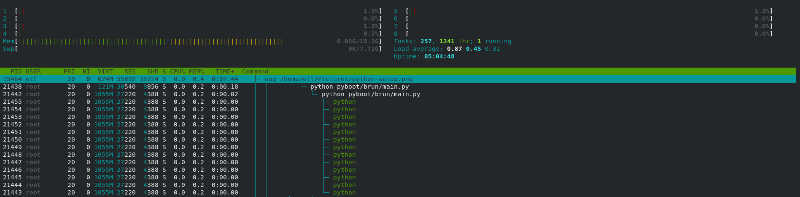

# pyboot

[英文](README.md) | 中文

该项目的初衷是为边缘计算场景调用边缘科学计算模型。

## Architecture




## Features


## Design
### 1. starter
系统组件可以通过 Starter 的实现进行扩展。
目前，系统提供了几个组件用于配置、多进程处理和webserver，
最后统一接受系统中断和停止信号调用`HookStarter`的Stop函数，恢复所有资源并停止服务。

1. `BaseConfStarter`:
   为整个系统提供统一自定义配置的相关参数。 
   相关配置信息可以通过修改`config.yaml`和`config.py`文件进行扩展，系统内置参数由`settings.py`文件提供；
2. `ProcessorStarter`:
   为边缘模型调用提供多进程和多线程调用功能，一个边缘模型默认的整体调用逻辑会扩展到一个独立的子进程，
   而对于一个模型调用，它的数据收发和模型调用，则在这个子进程的多线程中使用更多；
3. `TornadoServer` or `FlaskStarter`:
   为主进程提供统一的web服务，目前提供基于`Flask`和`Tornado`两个可选框架；
4. `HookStarter`:
   所有集成组件的`Stop`功能统一注册和管理，可以按优先级顺序回收资源，最终停止整个服务的运行；
### 2. boot
系统启动的引导程序, 将配置在brun/__init__.py中的各个Starter进行加载,并在boot.Starter()调用时,
依次执行所有Starter组件的Init, Setup, Start函数, 倒数第二个Starter应该是具有阻塞功能的组件(例如FlaskStarter, TornadoStarter), 
最后一个应该是HookStarter;


## Configuration
```yaml
---
app_name: pyboot
description: pyboot for edge calc
edge:
  - name: telm_temperature # subscirbe_name: sub_process_{name}_{instance}
    instance: 1
    # input data from mqtt broker
    pre_broker: 192.168.241.1
    pre_port: 1883
    pre_topic: /gridsum/test/telm/in/m1
    pre_qos: 0
    # edge model config path: {package_full_name}.{py_module_file_name}.{func_name}
    edge_mode: pyboot.modules.gridsum.science.industry.telemetry.telm_temperature
    # input data from mqtt broker
    post_broker: 192.168.241.1
    post_port: 1883
    post_topic: /gridsum/test/telm/out/m1
    post_qos: 0


```


## Start run

```shell
pip install -r /home/requirements.txt -i https://pypi.tuna.tsinghua.edu.cn/simple

export PYTHONPATH=$PYTHONPATH:`pwd`:'pwd'/pyboot

python pyboot/brun/main.py
```


## docker
提供了Makefile文件, 可以通过make images命令方便的进行docker镜像的生成,目前采用python:3.6-slim作为基础镜像;

## TODO
- [x] 持久层框架集成
- [x] 与边缘计算模型进行集成测试
- [x] 与kubernetes和kubeedge集成，编写相关yaml资源文件；
- [ ] ...