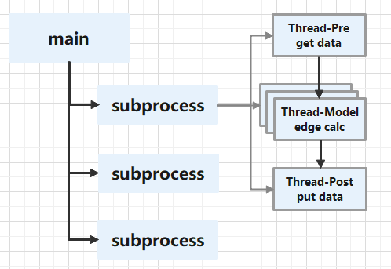
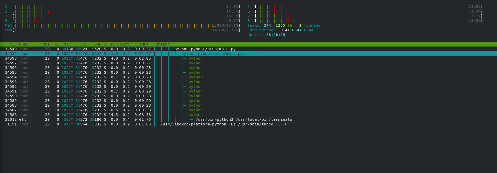
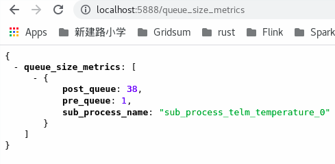
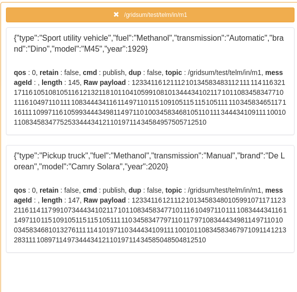
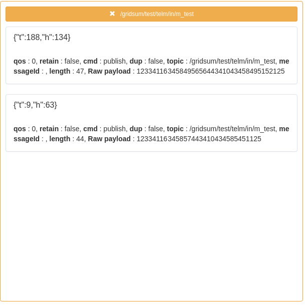
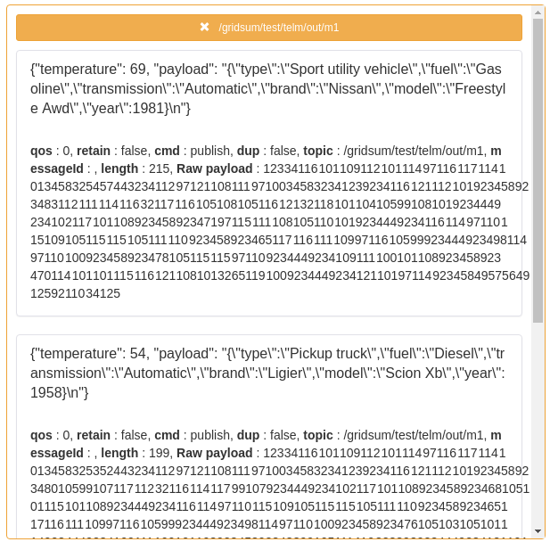
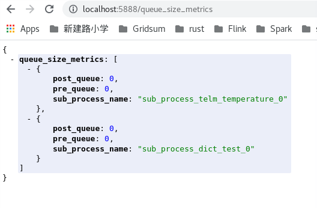

# pyboot

[英文](README.md) | 中文

该项目的初衷是为边缘计算场景调用边缘科学计算模型。

## Architecture





## Features
### 1. starter
系统组件可以通过 Starter 的实现进行扩展。
目前，系统提供了几个组件用于配置、多进程处理和webserver，
最后统一接受系统中断和停止信号调用`HookStarter`的Stop函数，恢复所有资源并停止服务。

1. `BaseConfStarter`:
   为整个系统提供统一自定义配置的相关参数。 
   相关配置信息可以通过修改`config.yaml`和`config.py`文件进行扩展，系统内置参数由`settings.py`文件提供；
2. `ProcessorStarter`:
   为边缘模型调用提供多进程和多线程调用功能，一个边缘模型默认的整体调用逻辑会扩展到一个独立的子进程，
   而对于一个模型调用，它的数据收发和模型调用，则在这个子进程的多线程中使用更多；
3. `TornadoServer` or `FlaskStarter`:
   为主进程提供统一的web服务，目前提供基于`Flask`和`Tornado`两个可选框架；
4. `HookStarter`:
   所有集成组件的`Stop`功能统一注册和管理，可以按优先级顺序回收资源，最终停止整个服务的运行；
### 2. boot
系统启动的引导程序, 将配置在brun/__init__.py中的各个Starter进行加载,并在boot.Starter()调用时,
依次执行所有Starter组件的Init, Setup, Start函数, 倒数第二个Starter应该是具有阻塞功能的组件(例如FlaskStarter, TornadoStarter), 
最后一个应该是HookStarter;

## Configuration
```yaml
# mqtt broker resources configuration
mqtts:
  - name: b1
    broker: tcp://192.168.241.1:1883
    qos: 0
    retain: false
  - name: b2
    broker: tcp://192.168.241.1:1883
    qos: 0
    retain: false
# rules configuration
rules:
  # subprocess 1
    # input data from mqtt broker
  - sub:
      name: b1
      clientId: 5555
      topic: /gridsum/test/telm/in/thend_threshold_test
    # output data from mqtt broker
    pub:
      name: b1
      clientId: 6666
      timeout: 10s
      topic: /gridsum/test/telm/out/thend_threshold_test
  # subprocess 2
  - sub:
      name: b1
      clientId: 7777
      topic: /gridsum/test/telm/in/thend_multivar_test
    pub:
      name: b1
      clientId: 8888
      timeout: 10s
      topic: /gridsum/test/telm/out/thend_multivar_test
funcs:
  - model_address: http://10.200.60.18:22122/group1/M00/00/0F/Ch1hQF-NYuyAHmhzAAHaYnbCrrs964.zip
    model_md5: pZ4DJ+YhYM9ppHD+VhLi+A==
    # edge model config path: pyboot/modules/gridsum/science/{modelName}
    # edge model reference function entry name for importlib: pyboot.modules.gridsum.science.{modelName}.index.index(event, context)
    modelName: thend_threshold_zd
    deviceName: 设备3
    pointName: OPC温度

```

## Start run
```shell
pip install -r pyboot/requirements.txt -i https://pypi.tuna.tsinghua.edu.cn/simple

export PYTHONPATH=$PYTHONPATH:`pwd`:'pwd'/pyboot

python pyboot/brun/main.py

# 如果希望自定义传入配置文件，可以传入参数，如果不传，默认会使用pyboot/conf/config.yaml的配置文件
python pyboot/brun/main.py --config pyboot/conf/config.yaml

# 如果希望程序自动下载，解压缩模型文件（目前支持.zip)，需要声明环境变量
export DOWNLOAD_MODEL=True

```

## check the performance
您可以向 `http://localhost:5888/queue_size_metrics` 发送 get 请求。
以获取服务消息处理的性能是否有阻塞, 如果 pre_queue 和 post_queue的值大于0,则说明当前服务存在性能积压.
可以调整增加服务实例或边缘模型线程数以提高效率,然而post_queue一般是向mqtt写消息,压力较大时可能依然会出现部分的瞬时积压;



## test
1. 本地安装docker环境, 下载数据生成器镜像:
```shell
export GOFAKE_IMAGE_TAG=v6.5.0-7-g4224d58
# 拉取镜像
docker pull docker.gridsumdissector.com/kubeedge/gofakeit-server@${GOFAKE_IMAGE_TAG}
# 运行
docker run -itd -p 18080:8080 --restart always --name gofaker docker.gridsumdissector.com/kubeedge/gofakeit-server:${GOFAKE_IMAGE_TAG}

```

2. 本地安装mqtt中间件mosquitto
```shell
yum install mosquitto -y
```

3. 下载消息转接程序
```shell
# 下载消息转接程序
mkdir $HOME/benthos/bin -p
cd $HOME/benthos/bin
curl --noproxy "*" -X GET -u 域账号:域账号密码 -O http://repository.gridsum.com/repository/cps/pkg/tools/benthos/x86_64/v3.49.0-3-g84709014/linux/amd64/bin/benthos
chmod +x benthos

# 下载转接程序配置文件
mkdir $HOME/benthos/conf -p
cd $HOME/benthos/conf
## 测试模型1 - 纯python函数
curl --noproxy "*" -X GET -u 域账号:域账号密码 -O http://repository.gridsum.com/repository/cps/pkg/tools/benthos/x86_64/v3.49.0-3-g84709014/linux/amd64/conf/http_mqtt_for_pyboot.yaml
## 测试模型2 - 加载pickle模型文件
curl --noproxy "*" -X GET -u 域账号:域账号密码 -O http://repository.gridsum.com/repository/cps/pkg/tools/benthos/x86_64/v3.49.0-3-g84709014/linux/amd64/conf/http_json_mqtt_for_pyboot.yaml

```
4. 启动消息转接程序
```shell
cd $HOME/benthos/bin
## 运行转接模型1需要的数据到本地mosquitto: topic=/gridsum/test/telm/in/m1
./benthos -c ../conf/http_mqtt_for_pyboot.yaml
## 运行转接模型2需要的数据到本地mosquitto: topic=/gridsum/test/telm/in/m_test
./benthos -c ../conf/http_json_mqtt_for_pyboot.yaml
```
5. 启动后可通过mqttbox观察数据格式
- 模型1 转接数据

- 模型2 转接数据


6. 此刻可以去pyboot工程中,启动`brun/main.py`来测试模型了
- 模型1 运行结果

- 模型2 运行结果


7. 可调节配置文件中单位时间内的qos参数, 进行性能测试
```yaml
rate_limit_resources:
  - label: foobar
    local:
      count: 1
      interval: 6s
```
- 通过接口查看数据处理的积压情况, 帮助了解模型性能:



## docker
提供了Makefile文件, 可以通过make images命令方便的进行docker镜像的生成,目前采用python:3.6-slim作为基础镜像;

## TODO
- [x] 持久层框架集成
- [x] 与边缘计算模型进行集成测试
- [x] 与kubernetes和kubeedge集成，编写相关yaml资源文件；
- [ ] ...