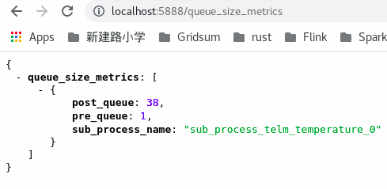
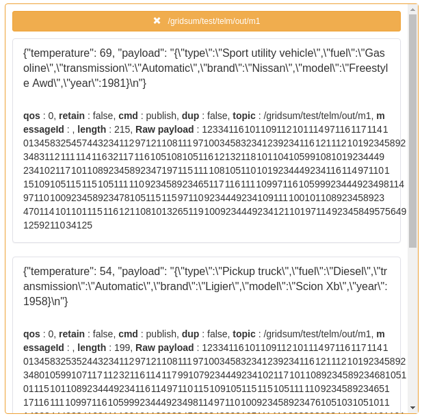
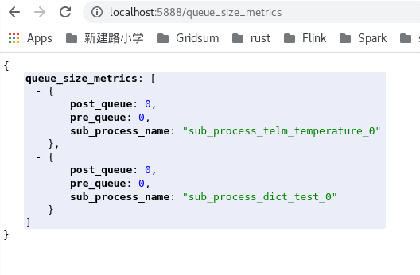

# 模型容器运行时

    该项目的初衷是为边缘计算场景调用边缘科学计算模型。

## Architecture


## Features
### 1. 样本数据

```json
{
    "deviceInfo": {
        "deviceName": "设备2",
        "edgeDeviceName": "设备three",
        "topic": "GG2",
        "edgeCalculation": false,
        "encryption": false,
        "compression": false
    },
    "telemetry": {
        "ts": 1585194439000,
        "RC_cylinder1_1P_d_dispPeak": 86,
        "OPC温度": 10370,
        "OPC湿度": "86",
        "OPC电量": true
    },
    "model_data": {
        "GS0101": "1.1",
        "GS0102": "1.2"
    }
}
```

### 2. 配置文件

```yaml
expose:
- desc: monitor the container
  name: monitor
  outPort: 38080
  protocolPort: http://:8080
# mapping of device and model
funcs:
- devices:
  - deviceName: "设备2"
    deviceAttr:
    - attrExpression: == data_to_dict['deviceInfo']['deviceName']
      attrName: deviceName
      attrValue: 设备2
    - attrExpression: in data_to_dict['telemetry']
      attrName: pointName
      attrValue: RC_cylinder1_1P_d_dispPeak
  modelAddress: http://10.200.60.18:9000/group1/M00/49/04/Csg8EmGdnIyAVJdVAAHaY0adxNc829.zip
  modelMd5: pZ4DJ+YhYM9ppHD+VhLi+A==
  modelName: industry
- devices:
  - deviceName: "三厂-pyboot测试设备2"
    deviceAttr:
    - attrExpression: == data_to_dict['deviceInfo']['deviceName']
      attrName: deviceName
      attrValue: 三厂-pyboot测试设备2
    - attrExpression: in data_to_dict['telemetry']
      attrName: pointName
      attrValue: pyboot2
  modelAddress: http://10.200.60.18:9000/group1/M00/49/04/Csg8EmGdnIyAVJdVAAHaY0adxNc833.zip
  modelMd5: pZ4DJ+YhYM9ppHD+VhLi+A=1
  modelName: test
# mqtt configuration
mqtts:
- broker: tcp://192.168.241.1:1883
  name: mosquitto-20336454-5413-4e2f-b52e-b945291359c7
  retain: false
rules:
- pub:
    clientId: ef2712a2-926d-4388-92d0-60470ab2613d
    name: mosquitto-20336454-5413-4e2f-b52e-b945291359c7
    timeout: 100
    topic: cloud/edge-pyboot-e060ff31-1644570929743-e54d4620-8b1a-11ec-9969-df2a36238047
  sub:
    clientId: ae03af75-13f5-4cf9-9145-0fea4e6ff1e4
    name: mosquitto-20336454-5413-4e2f-b52e-b945291359c7
    topic: cloud/edge-data-access-a60c2306-1644570929743-e54d4620-8b1a-11ec-9969-df2a36238047
```

### 3.配置文件面板渲染配置
采用jsonschema 1.4版本标准
```json
{
  "$version": 2,
  "schema": {
    "type": "object",
    "properties": {
      "mqtts": {
        "type": "array",
        "items": {
          "type": "object",
          "properties": {
            "name": {
              "type": "string",
              "title": "MQTT服务名"
            },
            "broker": {
              "type": "string",
              "title": "MQTT服务地址"
            },
            "qos": {
              "type": "number",
              "title": "QoS等级",
              "minimum": 0,
              "maximum": 2
            },
            "retain": {
              "type": "boolean",
              "title": "是否开启遗嘱消息"
            }
          },
          "required": [
            "name",
            "broker",
            "qos",
            "retain"
          ]
        },
        "title": "MQTT"
      },
      "rules": {
        "type": "array",
        "items": {
          "type": "object",
          "properties": {
            "sub": {
              "type": "object",
              "properties": {
                "name": {
                  "type": "string",
                  "title": "MQTT服务名"
                },
                "clientId": {
                  "type": "string",
                  "title": "MQTT客户端ID"
                },
                "topic": {
                  "type": "string",
                  "title": "MQTT订阅Topic"
                }
              },
              "title": "订阅者"
            },
            "pub": {
              "type": "object",
              "properties": {
                "name": {
                  "type": "string",
                  "title": "MQTT服务名"
                },
                "clientId": {
                  "type": "string",
                  "title": "MQTT客户端ID"
                },
                "timeout": {
                  "type": "number",
                  "title": "MQTT发布超时时间"
                },
                "topic": {
                  "type": "string",
                  "title": "MQTT发布Topic"
                }
              },
              "title": "发布者"
            }
          },
          "required": [
            "sub",
            "pub"
          ]
        },
        "title": "MQTT规则"
      },
      "funcs": {
        "type": "array",
        "items": {
          "type": "object",
          "properties": {
            "modelAddress": {
              "type": "string",
              "title": "模型压缩包地址"
            },
            "modelMd5": {
              "type": "string",
              "title": "模型压缩包md5"
            },
            "modelName": {
              "type": "string",
              "title": "模型名称"
            },
            "devices": {
              "type": "array",
              "title": "设备",
              "items": {
                "type": "object",
                "properties": {
                  "deviceName": {
                    "type": "string",
                    "title": "设备名称"
                  },
                  "deviceAttr": {
                    "type": "array",
                    "title": "设备属性",
                    "items": {
                      "type": "object",
                      "properties": {
                        "attrName": {
                          "type": "string",
                          "title": "属性名称"
                        },
                        "attrValue": {
                          "type": "string",
                          "title": "属性值"
                        },
                        "attrExpression": {
                          "type": "string",
                          "title": "对应数据解析表达式"
                        }
                      }
                    }
                  }
                }
              }
            }
          }
        },
        "title": "调用模型"
      },
      "expose": {
        "type": "array",
        "items": {
          "type": "object",
          "properties": {
            "name": {
              "type": "string",
              "title": "暴露端口名称",
              "required": true
            },
            "protocolPort": {
              "type": "string",
              "title": "集群协议端口",
              "required": true,
              "enum": [
                "http://:8080",
                "tcp://:2901"
              ]
            },
            "outPort": {
              "type": "number",
              "title": "集群外部端口",
              "required": true,
              "description": "暴露到边缘集群外部的端口",
              "exclusiveMinimum": true,
              "exclusiveMaximum": true,
              "minimum": 30000,
              "maximum": 60000
            },
            "desc": {
              "type": "string",
              "title": "暴露端口描述"
            }
          }
        }
      }
    }
  },
  "form": [
    "*"
  ],
  "inEnabled": false
}

```


## Start run
```shell
pip install -r pyboot/requirements.txt -i https://pypi.tuna.tsinghua.edu.cn/simple

export PYTHONPATH=$PYTHONPATH:`pwd`:'pwd'/pyboot

python pyboot/brun/main.py

# 如果希望自定义传入配置文件，可以传入参数，如果不传，默认会使用pyboot/conf/config.yaml的配置文件
python pyboot/brun/main.py --config pyboot/conf/config.yaml

# 如果希望程序自动下载，解压缩模型文件（目前支持.zip)，需要声明环境变量
export DOWNLOAD_MODEL=True

```

## check the performance
您可以向 `http://localhost:5888/queue_size_metrics` 发送 get 请求。
以获取服务消息处理的性能是否有阻塞, 如果 pre_queue 和 post_queue的值大于0,则说明当前服务存在性能积压.
可以调整增加服务实例或边缘模型线程数以提高效率,然而post_queue一般是向mqtt写消息,压力较大时可能依然会出现部分的瞬时积压;



## test
1. 本地安装docker环境, 下载数据生成器镜像:
```shell
export GOFAKE_IMAGE_TAG=v6.5.0-7-g4224d58
# 拉取镜像
docker pull docker.gridsumdissector.com/kubeedge/gofakeit-server@${GOFAKE_IMAGE_TAG}
# 运行
docker run -itd -p 18080:8080 --restart always --name gofaker docker.gridsumdissector.com/kubeedge/gofakeit-server:${GOFAKE_IMAGE_TAG}

```

2. 本地安装mqtt中间件mosquitto
```shell
yum install mosquitto -y
```

3. 下载消息转接程序
```shell
# 下载消息转接程序
mkdir $HOME/benthos/bin -p
cd $HOME/benthos/bin
curl --noproxy "*" -X GET -u 域账号:域账号密码 -O http://repository.gridsum.com/repository/cps/pkg/tools/benthos/x86_64/v3.49.0-3-g84709014/linux/amd64/bin/benthos
chmod +x benthos

# 下载转接程序配置文件
mkdir $HOME/benthos/conf -p
cd $HOME/benthos/conf
## 测试模型1 - 纯python函数
curl --noproxy "*" -X GET -u 域账号:域账号密码 -O http://repository.gridsum.com/repository/cps/pkg/tools/benthos/x86_64/v3.49.0-3-g84709014/linux/amd64/conf/http_mqtt_for_pyboot.yaml
## 测试模型2 - 加载pickle模型文件
curl --noproxy "*" -X GET -u 域账号:域账号密码 -O http://repository.gridsum.com/repository/cps/pkg/tools/benthos/x86_64/v3.49.0-3-g84709014/linux/amd64/conf/http_json_mqtt_for_pyboot.yaml

```
4. 启动消息转接程序
```shell
cd $HOME/benthos/bin
## 运行转接模型1需要的数据到本地mosquitto: topic=/gridsum/test/telm/in/m1
./benthos -c ../conf/http_mqtt_for_pyboot.yaml
## 运行转接模型2需要的数据到本地mosquitto: topic=/gridsum/test/telm/in/m_test
./benthos -c ../conf/http_json_mqtt_for_pyboot.yaml
```
5. 启动后可通过mqttbox观察数据格式
- 模型1 转接数据

- 模型2 转接数据


6. 此刻可以去pyboot工程中,启动`brun/main.py`来测试模型了
- 模型1 运行结果

- 模型2 运行结果


7. 可调节配置文件中单位时间内的qos参数, 进行性能测试
```yaml
rate_limit_resources:
  - label: foobar
    local:
      count: 1
      interval: 6s
```
- 通过接口查看数据处理的积压情况, 帮助了解模型性能:



## docker
提供了Makefile文件, 可以通过make images命令方便的进行docker镜像的生成,目前采用python:3.6-slim作为基础镜像;

## TODO
- [x] 持久层框架集成
- [x] 与边缘计算模型进行集成测试
- [x] 与kubernetes和kubeedge集成，编写相关yaml资源文件；
- [ ] ...